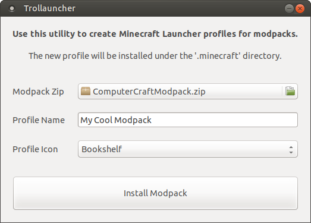
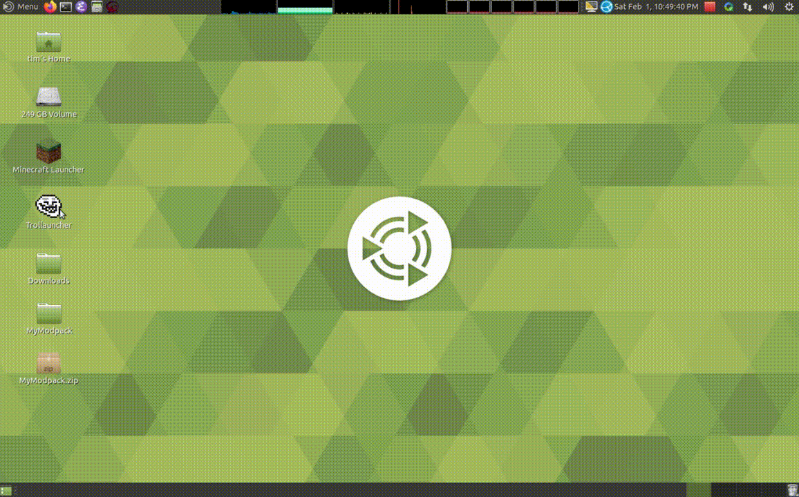

<p align="center">
    <a href="https://github.com/tprk77/trollauncher">
        
    </a>
</p>
<p align="center">
    <a href="https://github.com/tprk77/trollauncher/releases">
        <b>&gt;&gt; Download &lt;&lt;</b>
    </a>
</p>

<br/>

## Overview ##

Trollauncher is a modpack installer for the "Vanilla" Minecraft Launcher.

It's a simple, minimalist utility to make installing modpacks quick and easy.

<p align="center">
    
</p>

It will create a new profile, extract the modpack files, and if necessary,
install the right version of Forge.

**NOTE:** Trollauncher only works for modpack zip files that conform to a
specific layout! It does not work for arbitrary modpacks. Please read [Making
Modpacks](#making-modpacks) for more information.

## Demo ##

<p align="center">
    <a href="https://youtu.be/L-zkzFXI994">
        
    </a>
</p>

## Supported Software ##

| Java Edition | Bedrock Edition |
| ------------ | --------------- |
| YES          | NO              |

| Windows                 | Linux       | MacOs |
| ----------------------- |------------ |------ |
| YES (Stand-alone `exe`) | YES (`deb`) | NO    |

| Forge               | Fabric |
| ------------------- | ------ |
| YES (`>= MC 1.5.2`) | NO     |

## Features ##

* Works with Forge for all recent versions of Minecraft.
* Works together with the "Vanilla" Minecraft Launcher.
* Easy to use, better than manually installing mods.
* Easy to create modpacks, [just zip 'em up](#making-modpacks).

The "Vanilla" Minecraft Launcher is perfectly fine, but requires modpacks to be
installed manually. Manually installing modpacks is tedious, and mistakes can
introduce subtle errors that break the game. Other launchers like MultiMC don't
work with Forge beyond Minecraft 1.12 (at the time of writing).

**UPDATE:** As of [commit c9e851f][multimc_c9e851f], MultiMC was updated to work
with Forge via [ForgeWrapper][forge_wrapper] (following [some][multimc_ebb17cb]
[controversy][multimc_e6cc65c]). MultiMC is once again a viable option for
modern Minecraft with Forge.

## Know Issues & Planned Features ##

* The Forge installer isn't automated. You still have to click through it.
* Trollauncher isn't ported to MacOs (yet).

## Why the name? ##

Because I'm a fan of classic memes.

> It's an older meme, sir, but it checks out.

## Making Modpacks ##

Making a modpack is easy. You just need to zip up some files.

A typical modpack will look something like this:

```text
My_Modpack_Xyz_123/
├── config
│   └── ...
├── mods
│   └── ...
└── trollauncher
    └── installer.jar
```

**NOTE:** `config`, `mods`, and `trollauncher` directory names are
case-sensitive.

The top-level directory is optional, and can be named whatever you want (it's
not used for anything). The `mods` directory is where you should place all the
`jar` files for each of your mods. The `config` directory is where mods
typically locate their config files. There can also be additional directories
and files as needed. They will just get extracted with everything else.

The only slightly tricky thing is `trollauncher/installer.jar`, which must be a
valid Forge installer. At the moment, only Forge is supported. Trollauncher will
look for this file to determine the target Forge version of the modpack. It will
automatically start the Forge installer if it needs to be installed.

To give an example, you should download a Forge installer, e.g.,
`forge-1.14.4-28.1.0-installer.jar` and rename it to
`trollauncher/installer.jar` before zipping everything up. It must be a
`*-installer.jar`, it CANNOT be a `*-universal.jar`, even for older versions of
Forge where that would work. (This is a limitation of the current
implementation.)

**NOTE:** Please make sure that all your included mods allow for redistribution.
This is true for open source mods using popular licenses such as MIT, BSD,
Apache, etc. However, it is not true for some proprietary mods, or some mods
using wonky one-off licenses. Please beware!

## Developer Info ##

If you're a programmer, you can build Trollauncher yourself.

(Otherwise just download it from the [release page!][trollauncher_releases])

### Building On Ubuntu ###

```text
$ sudo apt-get update
$ sudo apt-get install build-essential python3-pip ninja-build \
    g++-8 libboost-all-dev libzip-dev libwxgtk3.0-dev libprocps-dev
$ sudo -H pip3 install meson
$ cd trollauncher
$ meson setup build
$ ninja -C build
```

On Ubuntu 18.04, you might need to specify a more recent compiler, like GCC 8,
to get all the necessary C++17 support:

```text
$ CC=gcc-8 CXX=g++-8 meson setup build
```

### Building On Windows ###

First install MSYS2, and start the MSYS2 MINGW64 Shell.

```text
$ pacman -Syu
$ pacman -Syu  # Yes, do it twice!
$ pacman -S mingw-w64-x86_64-toolchain \
    mingw-w64-x86_64-python-pip mingw-w64-x86_64-ninja \
    mingw-w64-x86_64-boost mingw-w64-x86_64-libzip \
    mingw-w64-x86_64-wxWidgets mingw-w64-x86_64-jbigkit
$ pip3 install meson
$ cd trollauncher
$ meson setup build
$ ninja -C build
```

JBIG-KIT is apparently a dependency of wxWidgets, but needs to be installed
explicitly for some reason.

## License ##

Trollauncher uses an MIT license. See `LICENSE.md` for details.

<!-- Links -->

[trollauncher_releases]: https://github.com/tprk77/trollauncher/releases
[multimc_c9e851f]: https://github.com/MultiMC/MultiMC5/commit/c9e851f12f501657629e41339ad604c3cfba82e1
[multimc_ebb17cb]: https://github.com/MultiMC/MultiMC5/commit/ebb17cb5f8b4b7771c28bb0286846aa52d29d6a0
[multimc_e6cc65c]: https://github.com/MultiMC/MultiMC5/commit/e6cc65cf69b3fb2c1fa08e6768669f826048af20
[forge_wrapper]: https://github.com/ZekerZhayard/ForgeWrapper

<!-- Local Variables: -->
<!-- fill-column: 80 -->
<!-- End: -->
